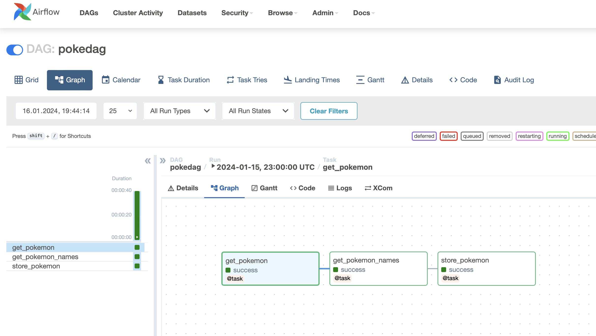
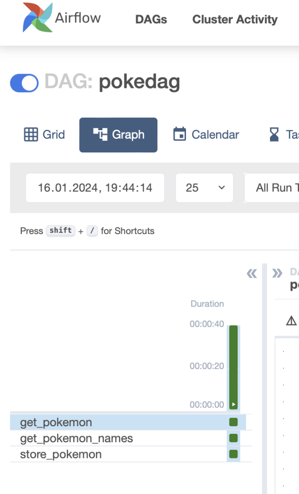

# PokeFlow

This project is designed to learn Apache Airflow, how to set it up locally on you're computer 
and to create basic DAGs.

It uses Apache Airflow to trigger a simple DAG which fetches the names of all Pokémon from the [PokeAPI](https://pokeapi.co/)
and stores them in a local file in JSON format (`pokemon.txt`).

In this program the DAG is using the [Taskflow API](https://airflow.apache.org/docs/apache-airflow/stable/tutorial/taskflow.html) to define the tasks.

The flow maps the following steps: 
1) Fetch the Pokémon data from API
2) Extract the names from result
3) Store the names in JSON file



# Future ideas

The data could be stored in a database instead of a local file. Alternatively, it could be uploaded 
to a cloud or HDFS as part of Hadoop for further processing. Of course, this is again for learning 
purposes only as the amount of data is very small. It would also be possible to process data such as 
Pokémon abilities and visualise their effectiveness in relation to different Pokémon types. This 
would require an extended Python application. 

# Setup notes
It is recommended to use a proper virtual environment for this project.

* Python version: 3.8.x
* Airflow version: 2.8.0

Documentation: https://airflow.apache.org/docs/apache-airflow/stable/start.html

## Install Airflow using project as home directory
```sh
export AIRFLOW_HOME=$(pwd)/airflow
AIRFLOW_VERSION=2.8.0
PYTHON_VERSION="$(python --version | cut -d " " -f 2 | cut -d "." -f 1-2)"
CONSTRAINT_URL="https://raw.githubusercontent.com/apache/airflow/constraints-${AIRFLOW_VERSION}/constraints-${PYTHON_VERSION}.txt"
pip install "apache-airflow==${AIRFLOW_VERSION}" --constraint "${CONSTRAINT_URL}"
```

## Run Airflow using project as home directory
```sh
NO_PROXY="*" AIRFLOW_HOME=$(AIRFLOW_HOME) airflow standalone
```

After this, Airflow runs at http://localhost:8080/

Login credentials are shown in the log output from Airflow, e.g.:
```
standalone | Airflow is ready
standalone | Login with username: admin  password: asdf
```

Note: `NO_PROXY="*"` is required to make Airflow work with Mac and sending requests,
for more info, see: https://github.com/apache/airflow/discussions/24463

## Remove example content
When starting Airflow the first time in standalone mode, it will set up some folders and files
within the project folder (if `AIRFLOW_HOME` was set correctly).

To remove the example content / templates, change the `airflow/airflow.cfg` file and set the
value for `load_examples` to `False`.

## Start the DAG
Once you have installed everything and added the project to your environment, you can call up 
the Airflow UI at http://localhost:8080/ and activate the DAG. You can start it and view the 
execution of the individual tasks. 


